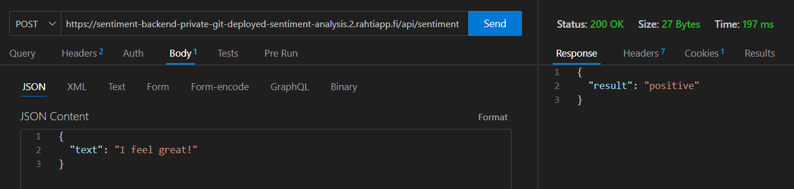

# Deployed-Sentiment-Backend

Backend sisältää POST-API-funktion, joka palauttaa tunneanalyysituloksen funktiolle välitetyn pyynnön sisältämästä tekstistä.

POST-pyyntö lähetetään seuraavaan resurssiin:
https://sentiment-backend-private-git-deployed-sentiment-analysis.2.rahtiapp.fi/api/sentiment

Pyyntöön on liitettävä JSON-muotoinen body, jossa on avain "text" valitulla arvolla.

## Esimerkki

