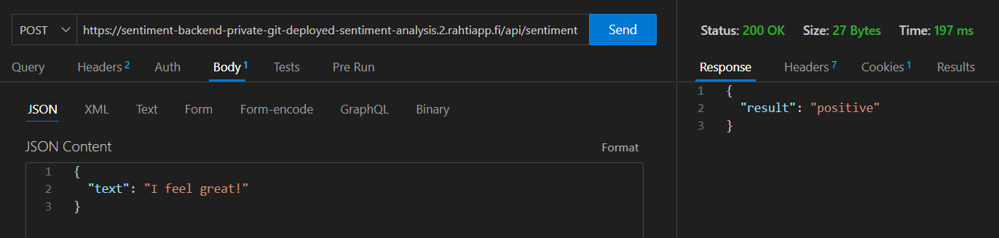
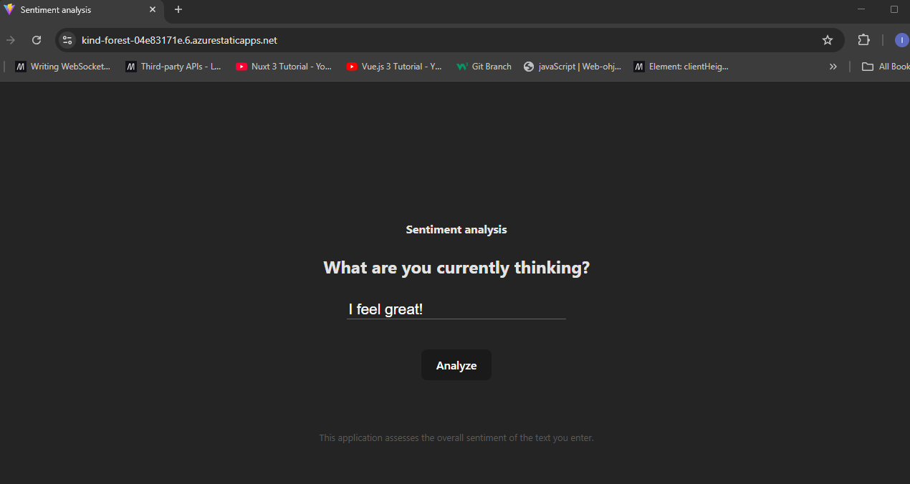
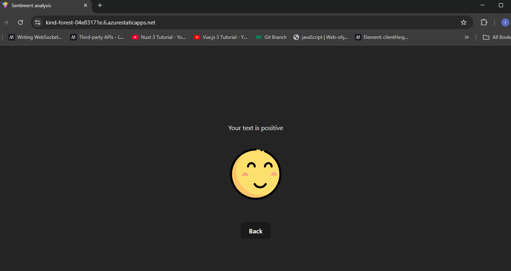

# Deployed-Sentiment-Backend

Backend sisältää POST-API-funktion, joka palauttaa tunneanalyysituloksen funktiolle välitetyn pyynnön sisältämästä tekstistä.

POST-pyyntö lähetetään seuraavaan resurssiin:
https://sentiment-backend-private-git-deployed-sentiment-analysis.2.rahtiapp.fi/api/sentiment

Pyyntöön on liitettävä JSON-muotoinen body, jossa on avain *"text"* valitulla arvolla.

Asetettujen CORS-käytänteiden vuoksi POST-API-funktiota voi käyttää ainoastaan paikallisesti osoitteesta http://localhost:5500.

Backendia käyttää lisäksi tälle backendille tehty frontend, joka on otettu käyttöön sekä [Renderissä](https://deployed-sentiment-analysis-frontend.onrender.com/) että [Azuressa](https://kind-forest-04e83171e.6.azurestaticapps.net/).

## Esimerkit

POST-web-API-tunneanalyysifunktion toiminta rajapintatyökalun kautta:

POST-web-API-tunneanalyysiresurssin hyödyntäminen Azuren kautta käyttöönotetussa frontendissa:

